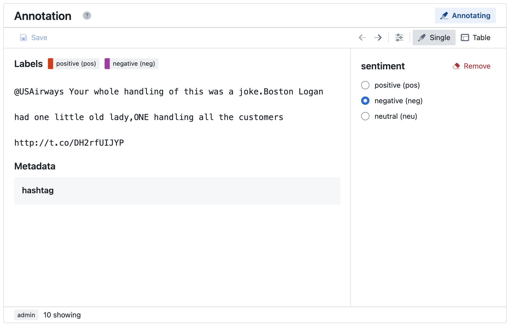

# Welcome to MEGAnno documentation
## What is MEGAnno?
MEGAnno is a human-LLM collaborative annotation framework. For cost-efficient and high-quality annotation, we adopt the LLM annotation <strong>--></strong> Human verification workflow where LLM agents label data first and then humans verify a subset of potentially problematic LLM labels.

 *Figure 1. Our human-LLM collaborative workflow.*

Our features include:

* Effective LLM agent and annotation management
* Convenient and robust LLM annotation
* Exploration and verification of LLM labels by humans
* Seamless annotation experience within Jupyter notebooks

## System Overview
MEGAnno provides two key components: (1) a Python client library featuring interactive widgets and (2) a back-end service consisting of web API and database servers. To use our system, a user can interact with a Jupyter Notebook that has the MEGAnno client installed. Through programmatic interfaces and UI widgets, the client communicates with the service.

 *Figure 2. Overview of MEGAnno+ system.*

**Subset**: refers to a slice of data created from user-defined searches. 

**Record**: refers to an item within the data corpus. 

**Agent**: an _Agent_ is defined by the configuration of the LLM (e.g., model’s name, version, and hyper-parameters) and a prompt template. 

**Job**: when an _Agent_ is employed to annotate a selected data _Subset_, the execution is referred to as a Job.

**Label**: stores the label assigned to a particular _Record_

**Label_Metdata**: captures additional aspects of a label, such as LLM confidence score or length of label response, etc.

**Verification**: captures annotations from human users that confirm or update LLM labels

## Demo
For Megagon hosted demo, please head to [https://meganno.github.io/](https://meganno.github.io/).
<video controls width='75%'>
    <source src="https://meganno.s3.amazonaws.com/eacl-2024-demo.mp4" type="video/mp4">
</video>

 *Table view of the annotation widget. Data examples are organized in a table for better exploration and comparison. Users can also search over, sort or filter on data and annotations.*

 *Single view of the annotation widget showing one data example at a time. With more space, the single view is more suitable for span-level tasks like extraction.*

Please see the [Getting Started](quickstart.md) page for setup instructions and the [Advanced Features](advanced.md) page for more cool features we provide.