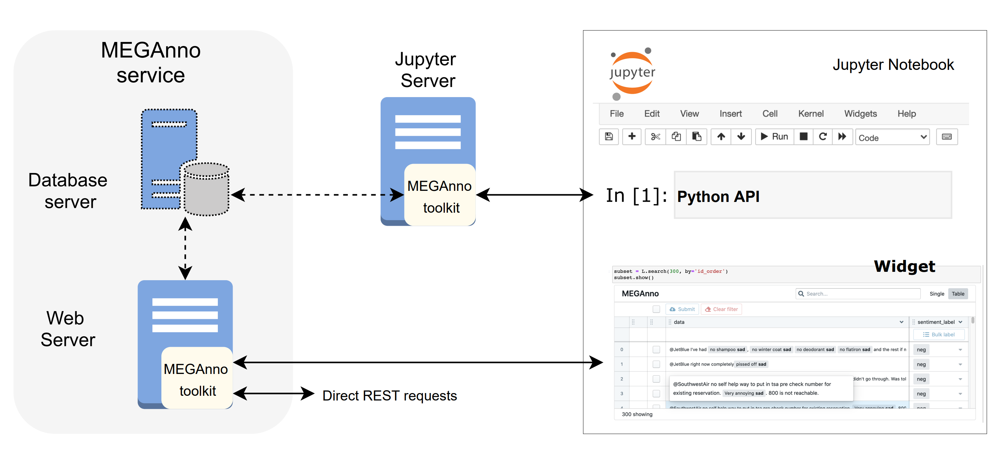

# Welcome to MEGAnno documentation
## How to get started?

There are 2 ways to get started with MEGAnno:

**1. Demo system access:**
For your convenience, we prepared a Google Colab notebook for this demo. To run the Colab notebook, you’ll need a Google account, an OpenAI API key, and a MEGAnno access token (you can get this by filling out the [request form](https://meganno.github.io/#request_form)).  

**2. Your own MEGAnno environment:**
To setup MEGAnno for your own projects, you can setup your own self-hosted MEGAnno service.  Please follow the [self-hosted instalation instructions](quickstart.md#self-hosted-service)

## What is MEGAnno?
Many existing data annotation tools are focussed on the annotator enabling them to annotate data and manage annotation activities.  Instead, MEGAnno is an open-source data annotation tool that puts the data scientist first, enabling you to bootstrap annotation tasks and manage the continual evolution of annotations through the machine learning lifecycle.  

In addition, MEGAnno’s unique capabilities include: 

* A back-end service that acts as a single source of truth and stores/manages all the evolution of annotation information through the lifecycle. 

* Power tools to explore data sets and select the best data to label.  Accommodations for active learning and other techniques to prioritize your labeling work.

* Explore the distribution of labels and the behavior of labelers to make decisions for subsequent labeling batches.  

* A data scientist-focused experience enabling you to manage annotation directly in your notebooks.  This allows you to utilize existing Python functions and our built-in power tools to optimize your annotation process.                       
* Seamlessly incorporate both human and LLM data labels with verification workflows and integration to popular LLMs.  This enables LLM agents to label data first and humans focus on verifying a subset of potentially problematic LLM labels.

 *Figure 1. MEGAnno unique capabilities*

## System Overview
MEGAnno provides two key components: (1) a Python client library featuring interactive widgets and (2) a back-end service consisting of web API and database servers. To use our system, a user can interact with a Jupyter Notebook that has the MEGAnno client installed. Through programmatic interfaces and UI widgets, the client communicates with the service.

 *Figure 2. Overview of MEGAnno+ system.*

**Subset**: refers to a slice of data created from user-defined searches. 

**Record**: refers to an item within the data corpus. 

**Agent**: an _Agent_ is defined by the configuration of the LLM (e.g., model’s name, version, and hyper-parameters) and a prompt template. 

**Job**: when an _Agent_ is employed to annotate a selected data _Subset_, the execution is referred to as a Job.

**Label**: stores the label assigned to a particular _Record_

**Label_Metdata**: captures additional aspects of a label, such as LLM confidence score or length of label response, etc.

**Verification**: captures annotations from human users that confirm or update LLM labels

Please see the [Getting Started](quickstart.md) page for setup instructions and the [Advanced Features](advanced.md) page for more cool features we provide.