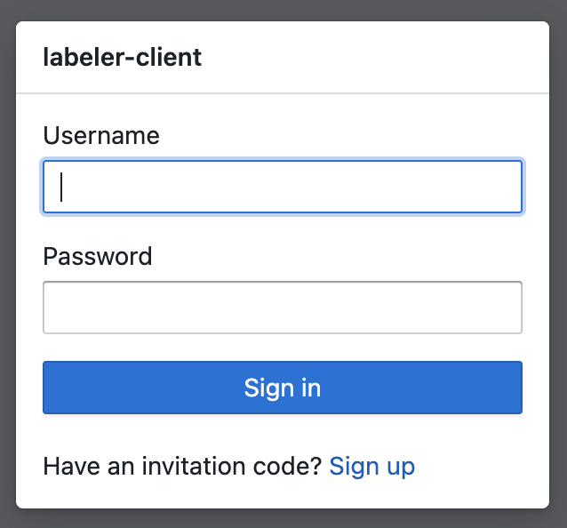

# Getting Started
## Installation
- Follow [instructions](https://github.com/megagonlabs/meganno-client?tab=readme-ov-file#installation) here to install meganno-client

## Self-hosted Service
- Download docker compose files at [meganno-service](https://github.com/megagonlabs/meganno-service)
- Follow [setup instructions](https://github.com/megagonlabs/meganno-service?tab=readme-ov-file#set-up-services) here to launch meganno backend services

## Authentication
We have 2 ways to authenticate with the service:

1. Short-term 1 hour access with username and password sign in.
    - Require re-authentication every hour.
    - After executing `auth = Authentication(project="<project_name>")` (this only works for notebook and terminal running on local computer), you will be provided with a sign in interface via a new browser tab.
        {: style="width:300px"}
   
    - After signing in, you will be able to generate a long-term personal access token by running `auth.create_access_token(expiration_duration=7, note="testing")`
        - `expiration_duration` is in days.
        - To have <strong>non-expiring</strong> token, set `expiration_duration` to 0 (under the hood, it still expires after 100 years).

2. Long-term access with access token without signing in every time.
    - If the notebook or terminal is running on the cloud, you need to use this method to authenticate with the service.
    - With the save token, you can initialize the authentication class object by executing: 
    ```python
    auth = Authentication(project="<project_name>", token="<your_token>")
    ```

### Roles
MEGAnno supports 2 types of user roles: Admin and Contributor. Admin users are project owners deploying the services; they have full access to the project such as importing data or updating schemas. **Admin users can invite contributors by sharing invitation code(s) with them.** Contributors can only access their own annotation namespace and cannot modify the project.

To invite contributors, follow the instructions below:

1. Initialize Admin class object:
```python
from meganno_client import Admin
token = "..."
auth = Authentication(project="<project_name>", token=token)

admin = Admin(project="eacl_demo", auth=auth)
# OR
admin = Admin(project="eacl_demo", token=token)
```
2. Genereate invitation code
    - invitation code has 7-day expiration duration
```python
admin.create_invitation(single_use=True, code="<invitation_code>", role_code="contributor")
```
3. To renew or revoke an existing invitation code:
    - after renewing, the expiration date is extended by another 7 days.
```python
admin.get_invitations()
admin.renew_invitation(id="<invitation_code_id>")
admin.revoke_invitation(id="<invitation_code_id>")
```
4. New users with valid invitation code can sign up by installing the client library and follow the instructions below:
    - After executing `auth = Authentication(project="<project_name>")`, a new browser tab will present itself.
    - Clicking on "Sign up" at the bottom of the dialog, and you will be taken to the sign up page.
    {: style="width:300px"}

### Role Access
<table border=1>
    <thead>
        <tr>
            <th>Method</th>
            <th>Route</th>
            <th>Role</th>
        </tr>
    </thead>
    <tbody>
        <tr>
            <td><code>GET</code> <code>POST</code></td>
            <td>/agents</td>
            <td rowspan=2><code>administrator</code> <code>contributor</code></td>
        </tr>
        <tr>
            <td><code>GET</code></td>
            <td>
                /agents/jobs
                <br/>
                /agents/&#60;string:agent_uuid&#62;/jobs
            </td>
        </tr>
        <tr>
            <td><code>GET</code> <code>POST</code></td>
            <td>
                /agents/&#60;string:agent_uuid&#62;/jobs/&#60;string:job_uuid&#62;
                <br/>
                /annotations/&#60;string:record_uuid&#62;
            </td>
            <td rowspan=2><code>administrator</code> <code>contributor</code> <code>job</code></td>
        </tr>
        <tr>
            <td rowspan=3><code>POST</code></td>
            <td>/annotations/batch</td>
        </tr>
        <tr>
            <td>/annotations/&#60;string:record_uuid&#62;/labels</td>
            <td><code>administrator</code> <code>contributor</code></td>
        </tr>
        <tr>
            <td>/annotations/label_metadata</td>
            <td><code>administrator</code> <code>contributor</code> <code>job</code></td>
        </tr>
        <tr>
            <td><code>GET</code> <code>POST</code></td>
            <td>/assignments</td>
            <td><code>administrator</code> <code>contributor</code></td>
        </tr>
        <tr>
            <td><code>POST</code></td>
            <td>
                /data
                <br/>
                /data/metadata
            </td>
            <td><code>administrator</code></td>
        </tr>
        <tr>
            <td><code>GET</code></td>
            <td>
                /data/export
                <br/>
                /data/suggest_similar
            </td>
            <td><code>administrator</code> <code>contributor</code></td>
        </tr>
        <tr>
            <td><code>GET</code></td>
            <td rowspan=2>/schemas</td>
            <td><code>administrator</code> <code>contributor</code> <code>job</code></td>
        </tr>
        <tr>
            <td><code>POST</code></td>
            <td><code>administrator</code></td>
        </tr>
        <tr>
            <td><code>POST</code></td>
            <td>/verifications/&#60;string:record_uuid&#62;/labels</td>
            <td><code>administrator</code> <code>contributor</code></td>
        </tr>
        <tr>
            <td rowspan=2><code>GET</code></td>
            <td>
                /annotations
                <br/>
                /view/record
                <br/>
                /view/annotation
                <br/>
                /view/verifications
            </td>
            <td><code>administrator</code> <code>contributor</code> <code>job</code></td>
        </tr>
        <tr>
            <td>/reconciliations</td>
            <td><code>administrator</code> <code>contributor</code></td>
        </tr>
        <tr>
            <td><code>GET</code></td>
            <td>
                /statistics/annotator/contributions
                <br/>
                /statistics/annotator/agreements
                <br/>
                /statistics/embeddings/&#60;embed_type&#62;
                <br/>
                /statistics/label/progress
                <br/>
                /statistics/label/distributions
            </td>
            <td><code>administrator</code></td>
        </tr>
        <tr>
            <td><code>GET</code> <code>POST</code> <code>PUT</code> <code>DELETE</code></td>
            <td>
                /invitations
            </td>
            <td rowspan=2><code>administrator</code></td>
        </tr>
        <tr>
            <td><code>GET</code></td>
            <td>
                /invitations/&#60;invitation_code&#62;
            </td>
        </tr>
        <tr>
            <td><code>GET</code> <code>POST</code> <code>DELETE</code></td>
            <td>
                /tokens
            </td>
            <td><code>administrator</code> <code>contributor</code></td>
        </tr>
    </tbody>
</table>